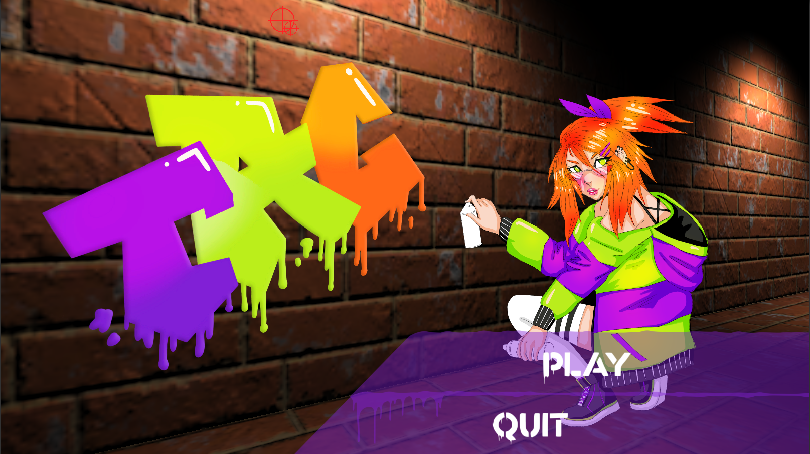
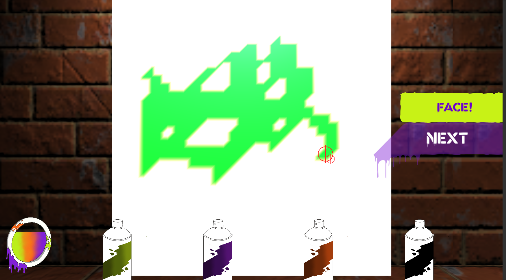

# TeamTag

## ScreenShot:



## Code Sample:
> Face painting of a mesh
```csharp
private void CastSpray(Vector3 i_sprayScreenPos, out Vector3 o_canvasPoint)
    {
        Ray         sprayLine = _mainCamera.ScreenPointToRay(i_sprayScreenPos);
        RaycastHit  sprayHit;

        if (Physics.Raycast(sprayLine.origin, sprayLine.direction.normalized, out sprayHit, SprayDistance))
        {

#if SPRAY_DEBUG
            Debug.DrawRay(sprayLine.origin, sprayLine.direction.normalized * sprayHit.distance, Color.red);
#endif
            
            o_canvasPoint = sprayHit.point;

            // Find if something is hit
            Renderer rend = sprayHit.transform.GetComponent<Renderer>();
            MeshCollider meshCollider = sprayHit.collider as MeshCollider;

            //Debug.Log(meshCollider.gameObject.name);

            if (rend == null || rend.sharedMaterial == null || meshCollider == null)
                return;

            //Debug.Log(rend.sharedMaterial);

            //Find the game object being hit by spray
            _mesh = meshCollider.gameObject.GetComponent<MeshFilter>().sharedMesh;
            int[] triangles = _mesh.triangles;

            //Debug.Log(_mesh.name);
            //Clear the paint at the play
            if (!_newColArray)
            {
                _newColArray = true;
                _colorArray = new Color[_mesh.vertices.Length];
            }

            //Find the face hit by cast
            int vert1 = triangles[sprayHit.triangleIndex * 3 + 0];
            int vert2 = triangles[sprayHit.triangleIndex * 3 + 1];
            int vert3 = triangles[sprayHit.triangleIndex * 3 + 2];

            //color the face
            if (vert1 < _colorArray.Length &&
                vert2 < _colorArray.Length &&
                vert3 < _colorArray.Length)
            {
                _colorArray[vert1] = _sprayCan.color;
                _colorArray[vert2] = _sprayCan.color;
                _colorArray[vert3] = _sprayCan.color;

                if (_mesh.colors.Length == _colorArray.Length)
                    _mesh.colors = _colorArray;
            }
        }
        else
        {
            o_canvasPoint = Vector3.zero;
        }
    }
    private void OnApplicationQuit()
    {
        ClearWall();
    }

    public void ClearWall()
    {
        if (_newColArray)
            _colorArray = new Color[_mesh.vertices.Length];
        if (_mesh)
            _mesh.colors = _colorArray;
    }
```

> Make all white pixels of a texture transparent
```csharp
Texture2D RTImage(Camera camera)
    {
        // The Render Texture in RenderTexture.active is the one
        // that will be read by ReadPixels.
        var currentRT = RenderTexture.active;
        RenderTexture.active = camera.targetTexture;

        // Render the camera's view.
        camera.Render();

        // Make a new texture and read the active Render Texture into it.
        Texture2D image = new Texture2D(camera.targetTexture.width, camera.targetTexture.height);
        image.ReadPixels(new Rect(0, 0, camera.targetTexture.width, camera.targetTexture.height), 0, 0);
        image.Apply();

        // Replace the original active Render Texture.
        RenderTexture.active = currentRT;
        return image;
    }
```